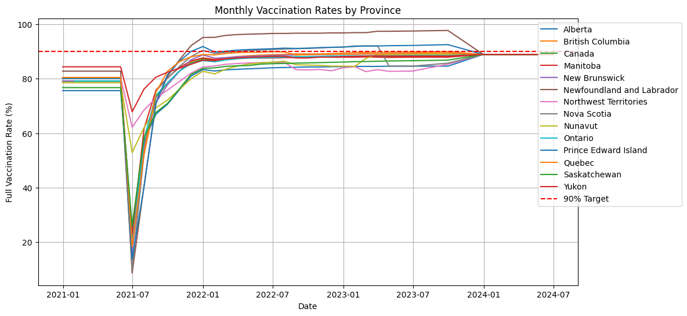
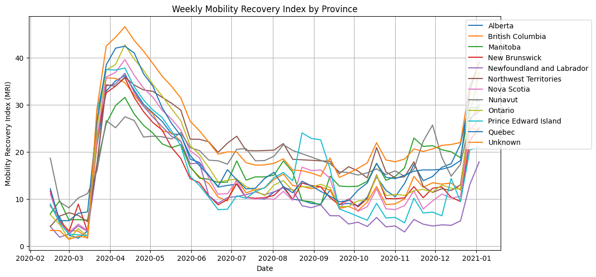
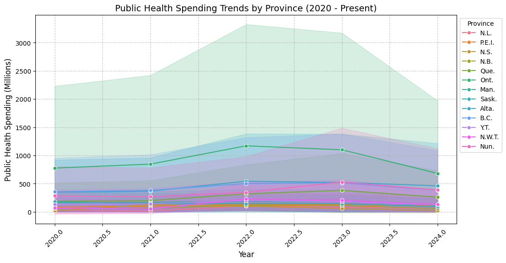
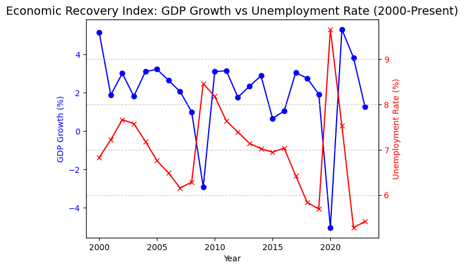

# COVID-19 Recovery Trends and Socioeconomic Impacts

*By: Owen Pensom*
## **Executive Summary**

The study evaluates how Canada recovered from the COVID-19 pandemic with regards to socioeconomic factors. The key drivers of our analysis will be economic trends, public health, and finally mobility indicators. We will be using trusted statistical organizations to gather our data, from platforms like statistics canada, google mobility reports, and the world bank. The goal of the analysis of this data will allow us to determine common trends, measure progress, and show the similarities and differences of recovery between different geographic regions. We aim to use a combination of statistical analysis and data manipulation/visualization to allow policymakers and stakeholders to have further insights and understanding. Through this approach, we will be able to evaluate and comprehend the long and short term impacts that the COVID-19 pandemic had on canada. 

[Read detailed background information here](Background.md)

## Key Performance Indicators (KPIs)

1. ### **Vaccination Rates**

  * Tracks the percentage of the population vaccinated over time.  
  * Target: Achieve 90% full vaccination coverage across all provinces, the current national average of 85%.  
  * Monthly updates from public health agencies.
  * Value Statement: Tracking vaccination rates helps control the spread of the virus, protect vulnerable populations, and support economic recovery by reducing restrictions.

    The visualization shows the vaccination rates from all the provinces over time, there is a target line of 90%. When we look at the data, we can see that some of the provinces have met or gone above the targeted 90%, while there are other provinces that have stayed below the target, this contributes to the current national average that we have of 85%. We can see that there is a significant drop in vaccination rates in the mid 2021 year, this is because of reporting issues and data adjustments. However, there is an upwards trend right after which shows the success of the public health vaccination campaigns. By monitoring our Vaccination progress, it shows us if we are close to achieving herd immunity, minimizes the strain put on health care, and finally gives us an idea of what to expect economically in future similar situations. 
2. ### **Mobility Recovery Index**

  * Measures the return to pre-pandemic activity levels across workplaces, retail, and residential organizations/companies.  
  * Target: Reach pre-pandemic mobility levels in all regions.  
  * Weekly updates using Google Mobility Reports.
  * Value Statement: Monitoring mobility shows how communities are returning to normal, which is key for social and economic recovery.

This visualization shows and tracks the weekly mobility recovery index (MRI), across all of the Canadian provinces. The visual shows how the movement patterns and trends changed during the pandemic, we see that there is a sharp spike in 2020, this is due to the drop in mobility after the lockdown was put in place. There are a lot of fluctuations in 2020, this shows the different times that we went from lockdowns to lifting restrictions. At the end of 2020 when there is a constant rise, this is because of restrictions being lifted. We have not been able to reach the target of pre pandemic numbers. Monitoring MRI is very important for analyzing economic recovery, business operations and community well being.

3. ### **Unemployment Rate Trends**

  * Continuously watching the changes in unemployment rates to evaluate how our economy has recovered.  
  * Target: Reduce unemployment to pre-pandemic levels, the current national unemployment rate is 7.5%.  
  * Monthly reporting from Statistics Canada.
  * Value Statement: Tracking unemployment rates reflects job market health and overall economic stability.
  
This visualization represents the unemployment rate trends from a year before COVID, 2019 till present. It shows the economic impacts that the pandemic had on Canada. There was a sharp spike in 2020 which is directly related to job loss experienced at the start of the pandemic, the peak was above 14%. After this we can see there is a slow and gradual decline, this shows that we were doing economic recovery efforts. There was another drop in 2022 which was similar to the COVID numbers, the recent trends show that there is a slight upwards trend with numbers around 7.5%, this tells us that we have not reached pre pandemic numbers. Unemployment rate trends is important because it lets us analyze economic stability, labor market recovery, and the effectiveness of policies meant to help the workforce. 

4. ### **Public Health Spending Changes**

  * Evaluating and understanding the provincial-level spending on healthcare during the pandemic and its impact on recovery.  
  * Target: Increase the healthcare spending growth of at least 5% in regions that are not receiving fair ressources, the current average   
    growth of 3.8%.  
  * Annual evaluation through provincial budget reports.
  * Value Statement: Analyzing healthcare spending ensures fair resources and stronger recovery.
    

The visualization shows public health spending trends organized by province from 2020 till present. A concern is that there are massive gaps between provinces and their spending, Ontario and Quebec have much higher numbers in spending when being compared to the smaller provinces, which have much lower numbers. There was a peak in 2022 which shows the pandemic related emergency funding that was spent. This tells us that there was a temporary increase in spending to resolve the issues, rather than an increase and growth in the spending budget. The data shows that there is an unfair resource allocation, as there are multiple underfunded provinces. The goal of a 5% growth rate in spending for underfunded provinces would help recovery and create long term sustainability. 

5. ### **Economic Recovery Index**
  * Combines Canada’s GDP growth and unemployment rates and trends  to evaluate overall recovery of the economy.  
  * Achieve a GDP growth rate of at least 2.5% annually while maintaining an unemployment rate below 6.5%. The current GDP growth rate of        1.8% and unemployment rate of 7.5%.  
  * Quarterly assessments using Statistics Canada and the World Bank data.
  * Value Statement: The index provides a clear picture of economic recovery, balancing growth and job creation.
  
This visualization takes and compares the GDP growth (shown as blue) and compares it to the unemployment rates (shown as red) from 2000 till present. There is a relationship between these 2 metrics because it shows economic decline, as there is negative GDP growth, which goes hand in hand with the rise in unemployment. This trend happens twice, firstly in 2008 with the financial crisis and secondly in 2020 with the pandemic. The quick then sudden rise again shows the government's efforts to recover the GDP growth. However, unemployment rates have not returned to pre pandemic numbers. Monitoring these 2 metrics side by side is important because it shows how government spending is helping support the economy and the labor force recovery. 