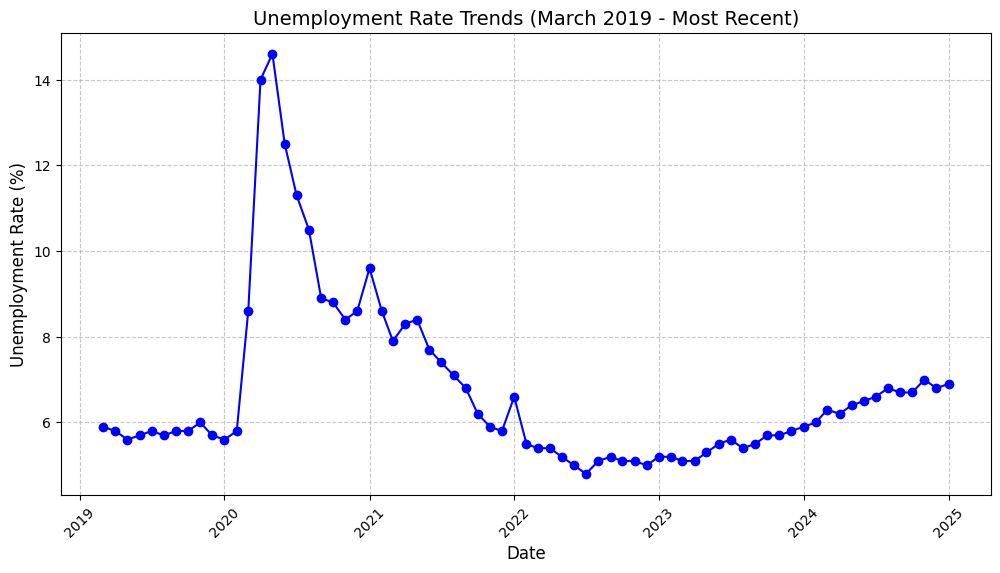

# COVID-19 Recovery Trends and Socioeconomic Impacts

*By: Owen Pensom*
## **Executive Summary**

The study evaluates how Canada recovered from the COVID-19 pandemic with regards to socioeconomic factors. The key drivers of our analysis will be economic trends, public health, and finally mobility indicators. We will be using trusted statistical organizations to gather our data, from platforms like statistics canada, google mobility reports, and the world bank. The goal of the analysis of this data will allow us to determine common trends, measure progress, and show the similarities and differences of recovery between different geographic regions. We aim to use a combination of statistical analysis and data manipulation/visualization to allow policymakers and stakeholders to have further insights and understanding. Through this approach, we will be able to evaluate and comprehend the long and short term impacts that the COVID-19 pandemic had on canada. 

[Read detailed background information here](Background.md)

## Key Performance Indicators (KPIs)

1. ### **Vaccination Rates**

  * Tracks the percentage of the population vaccinated over time.  
  * Target: Achieve 90% full vaccination coverage across all provinces, the current national average of 85%.  
  * Monthly updates from public health agencies.
  * Value Statement: Tracking vaccination rates helps control the spread of the virus, protect vulnerable populations, and support economic recovery by reducing restrictions.

    
2. ### **Mobility Recovery Index**

  * Measures the return to pre-pandemic activity levels across workplaces, retail, and residential organizations/companies.  
  * Target: Reach pre-pandemic mobility levels in all regions.  
  * Weekly updates using Google Mobility Reports.
  * Value Statement: Monitoring mobility shows how communities are returning to normal, which is key for social and economic recovery.

3. ### **Unemployment Rate Trends**

  * Continuously watching the changes in unemployment rates to evaluate how our economy has recovered.  
  * Target: Reduce unemployment to pre-pandemic levels, the current national unemployment rate is 7.5%.  
  * Monthly reporting from Statistics Canada.
  * Value Statement: Tracking unemployment rates reflects job market health and overall economic stability.
  

    
4. ### **Public Health Spending Changes**

  * Evaluating and understanding the provincial-level spending on healthcare during the pandemic and its impact on recovery.  
  * Target: Increase the healthcare spending growth of at least 5% in regions that are not receiving fair ressources, the current average   
    growth of 3.8%.  
  * Annual evaluation through provincial budget reports.
  * Value Statement: Analyzing healthcare spending ensures fair resources and stronger recovery.
    
5. ### **Economic Recovery Index**
  * Combines Canada’s GDP growth and unemployment rates and trends  to evaluate overall recovery of the economy.  
  * Achieve a GDP growth rate of at least 2.5% annually while maintaining an unemployment rate below 6.5%. The current GDP growth rate of        1.8% and unemployment rate of 7.5%.  
  * Quarterly assessments using Statistics Canada and the World Bank data.
  * Value Statement: The index provides a clear picture of economic recovery, balancing growth and job creation.

6. ### **Regional Disparity in Recovery**

  * Compares recovery trends across provinces to see recovery differences by regions.  
  * Target: Reduce the unemployment rate gap between provinces to below 2 percent. The Current difference is 4 percent between the highest       province/region and lowest province/region unemployment rates.  
  * Quarterly reviews using provincial unemployment data from Statistics Canada.
  * Value Statement: Reducing regional gaps ensures a fair and balanced recovery for all provinces.

